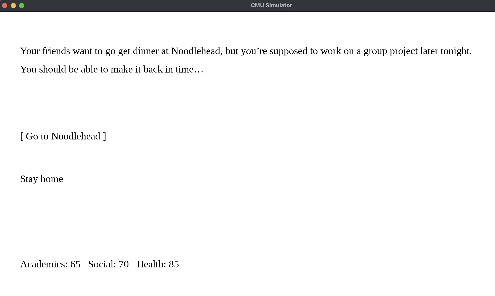

# CMU Simulator

Author: Aria Zhang

Design: It's your first semester at CMU, so you're put to the test balancing choices that affect your grades, social life and health. Choose wisely because every choice has multiple outcomes-- leaving your success at CMU based on your choices as well as plain luck. 

Text Drawing: Text shaping/ spacing was done with Harfbuzz and the rendering was done using TrueType and integrated with Opengl. All the text for the game including dialogue, choices, and side effects are read in at run-time, and when there is a request for a particular line to be rendered, textures for the glyphs for that line are generated once and then cached in memory to be reused.

Screen Shot:

How To Play:

Don't let your academics, social, or health drop to 0!

Choose between options with the UP and DOWN key. Click ENTER to progress.

Sources:

The code for integrating opengl with TrueType was heavily inspired by https://learnopengl.com/In-Practice/Text-Rendering and the use of harfbuzz was heavily inspired by https://github.com/harfbuzz/harfbuzz-tutorial/blob/master/hello-harfbuzz-freetype.c.

Font: Liberation Serif. The Liberation(tm) version 2.00.0 onward are Licensed under the SIL Open Font License, Version 1.1.

This game was built with [NEST](NEST.md).

